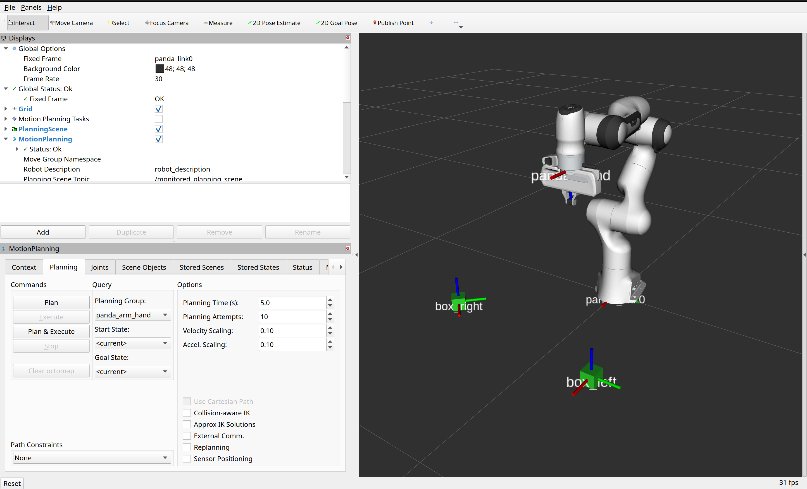

# Manipulator tutorial

This tutorial introduces the fundamental concepts of robotic manipulation using ROS 2 and MoveIt 2.
You will progressively explore how robots move by controlling joints, understanding coordinate frames (TF), and solving forward and inverse kinematics problems.

By the end of this tutorial, you will execute a simple pick-and-place task.

## Instalation

1. Clone the repo: `https://github.com/mariaslopes/manipulator_tutorial.git`

2. Install dependencies:
```bash
rosdep install --from-paths src/manipulator_tutorial -i -y
```

## Tutorial

### 1. Joint Control

1. Explore how each joint affects the robot configuration.

    Launch the robot model with a graphical interface that allows you to move the joints manually.

    ```bash
    ros2 launch manipulator_tutorial robot_visualization.launch.py 
    ```
    Move the sliders and observe how each joint changes the robot's pose.

2. CHeck the robots structure (TF tree). In another terminal run:

    ```bash
    ros2 run rqt_tf_tree rqt_tf_tree
    ```

### 2. Task Planning

**Goal:** Move 'box_left' so it sits perfectly on top of 'box_right'.

1. Launch the given environment with the pre-configured boxes.

    * In one terminal
      ```bash
      ros2 launch manipulator_tutorial robot_bringup.launch.py
      ```

    * In another terminal
      ```bash
      ros2 launch manipulator_tutorial task_launch.launch.py 
      ```
    * You should see:
    

2. Where is the box? 

    Before moving the robot, you must determine where the object is located.

    Robots do not "see" objects directly. Instead, they rely on coordinate frames defined in the TF tree.

    Use the TF tool to determine the position of box_left relative to the robot base.

    Record the pose of the box: $(x, y, z, qx, qy, qz, qw)$

    Hint: ros2 run tf2_ros tf2_echo <target_frame> <object_frame>.

3. Can the arm reach the? (Inverse Kinematics)

    Knowing where the box is located is not enough.

    The robot must determine how to move its joints to reach that position.

    This is known as Inverse Kinematics (IK). 
    
    Your task is to compute the joint configuration that places the end-effector at the box position.

    #### Steps:

    1. Fill the file `config/request.yaml` file
    2. `colcon build && source install/setup.install`
    3. `ros2 run manipulator_tutorial ik_request.py`
    4. In RViz, open the Joints panel and manually set the joints to the values returned by the IK solver.
    5. Verify the solution: Planning Tab > Click Plan and Execute

        **Note:** Give the finger joint a value of 0.040, so that the gripper is open.

    **Extra Experiment**: 
    * Move the robot to a random configuration: (chose joint values or use Goal State > Random valid > Plan and Execute)
    * Compute the IK solution again. (step 2)
    * Is the IK solution the same? Why/why not? Does the robot still reach the correct pose?

4. Now select the place position (repeat the previous steps and check the result)

    **Hint:** Find the pose of box_right using TF and modify the z coordinate: `z = z + 0.05` (This places the box slightly above box_right).

5. Now see everything working together stop second terminal and run:

    ```bash
    ros2 launch manipulator_tutorial task_launch.launch.py mode:=1
    ```

    The robot should execute the full pick-and-place task.

### 3. Forward kinematics

Another way to determine the pose of an object is to move the robot to that position and compute the end-effector pose. This uses Forward Kinematics (FK).

1. Relaunch the envoironment

  * In one terminal
    ```bash
    ros2 launch manipulator_tutorial robot_bringup.launch.py
    ```

  * In another terminal
    ```bash
    ros2 launch manipulator_tutorial task_launch.launch.py 
    ```

2. Move the robot to box_left (use either the model or the Joint Panel). Then click: `Plan and Execute`

3. Compute the end-effector pose:

    ```bash
    ros2 run manipulator_tutorial fk_request.py
    ```

4. Compare the solution with the one obtained in 2.2. Are the poses identical? If there is a difference, why might that happen?

